<p align="center">
  
</p>

# DaysUntil

A macOS menubar app that shows countdown badges for upcoming events. Each countdown gets its own menubar icon — a rounded square with the number of days remaining punched out as transparent digits.

## Features

- Multiple simultaneous countdowns, each as its own menubar icon
- Flame effect on icons as deadlines approach (≤5 days, toggleable)
- Flashing icon on day zero
- Click any icon for a popover with details; gear button opens shared settings
- Drag icons to reorder (⌘-drag)

## Install

```sh
brew install bn-l/tap/days-until
```

## Requirements

- macOS 15+
- Swift 6.2+

## Development

```sh
just app      # Build to ./build/DaysUntil.app
just run      # Build and open
just gen      # Regenerate .xcodeproj from project.yml
just clean    # Remove build artifacts
```

### Testing

```sh
swift test
```
